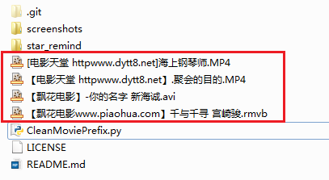

# xtools
平时写的各种小工具集合 - 想起来就更新

## Done
* [**star_remind**](#star_remind---有人在github上star你的项目，立刻发送邮件提醒自己) - 有人在github上star你的项目，立刻发送邮件提醒自己
* [**CleanMoviePrefix**](#cleanmovieprefix---清洗电影文件广告前缀) - 清洗电影文件广告前缀 
* [**put\_oss/get\_oss**](#put\_oss/get\_oss---阿里云OSS上传/下载文件脚本) - 阿里云OSS上传/下载文件脚本

##star_remind - 有人在github上star你的项目，立刻发送邮件提醒自己
模拟登陆github + 抓取star动态 + 邮件发送

可以挂到服务器上全天候运行

运行程序  

收到提示邮件  

linux运行截图  

##CleanMoviePrefix - 清洗电影文件广告前缀

双击运行程序，清洗当前目录下电影文件的广告前缀

清洗前：  

清洗后：  

* 测试环境为**windows/linux + python2.7**

##put\_oss/get\_oss - 阿里云OSS上传/下载文件脚本
因为从云服务器的linux系统往本地的windows系统传文件不太方便，所以写了这个工具

**put\_oss**是linux端文件**上传**脚本  
**get\_oss**是windows端文件**下载**脚本

linux端上传文件  

云端查看上传的文件  

windows端下载刚刚上传的文件  

 
可以在linux端把上传程序设置为默认命令  
这样在任何目录下都可以调用该命令  

* 脚本里需要修改成自己的阿里云访问秘钥